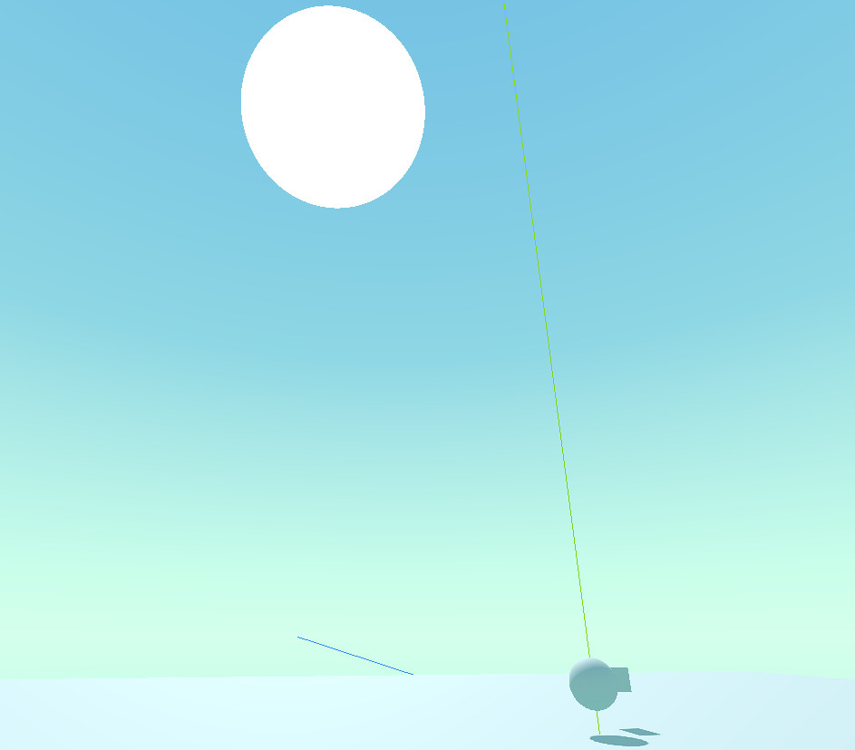
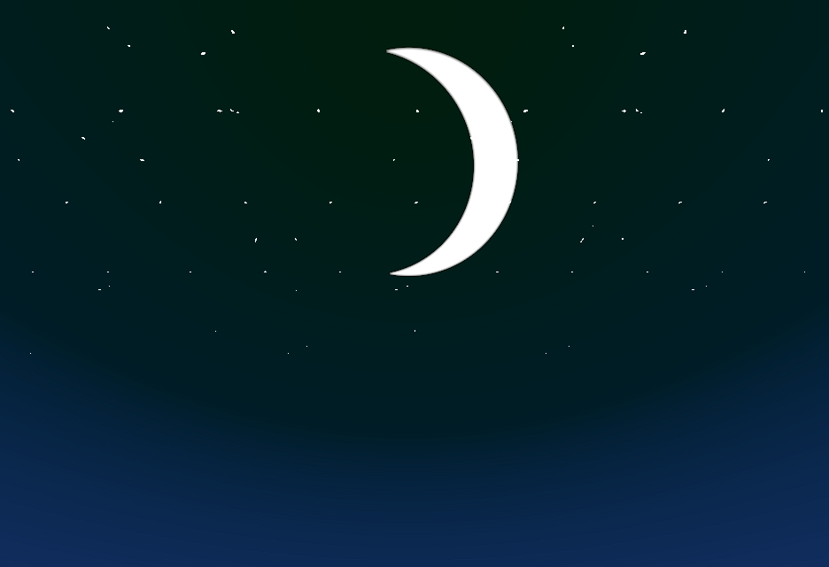

# Godot 4 Stylized Sky Shader

-> Updated to Beta 2

The original shader code is from Joyce aka. [MinionsArt's Patreon](https://www.patreon.com/posts/making-stylized-27402644 "Awesome tutorials here!") under [CC Attributions 4.0](https://creativecommons.org/licenses/by/4.0/)

I ported most of the code over to the project. Some of the variables had to be adjusted so the look of the scene could be replicated as close as possible.

## Showcase

### Animation!

## License
Apart from the original code being from Joyce aka. MinionsArt, the changes I made are licensed under [CC Attributions 4.0](https://creativecommons.org/licenses/by/4.0/) as well under Patrick Exner aka. FlameLizard. You can link to either my GitHub profile or my [Twitter profile](https://twitter.com/patrick_exe)
